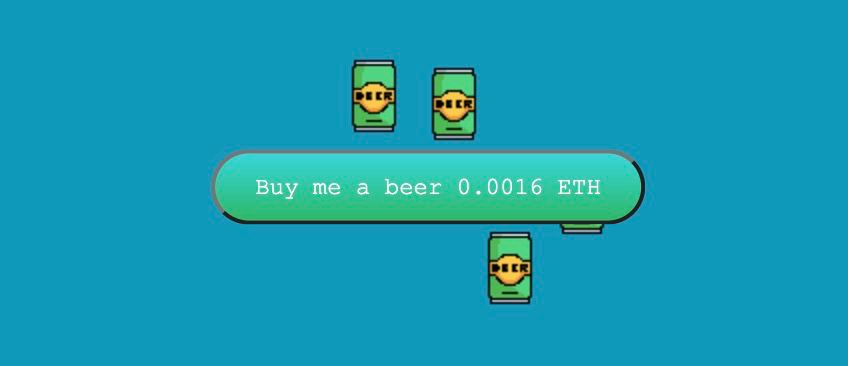

## Buy me a beer

DAPP project with metamask integration. After tap on `buy me a beer` button opened metamask wallet for perform transaction.  

## Up & Runnig

From `hardhat` folder:  

- `npm i` - install dependencies  
- `npm run node` - up hardhat network (returns list of test accounts)
- `npm run deploy` - deploy wallet contract (at this point copy.js script copy required artifacts to frontend folder), also you may need to change value for `WALLET ADDRESS` const.

From `frontend` folder:

- `npm i` - install dependencies  
- `npm run dev` - run dev server, browse site at `http://localhost:5173/`  

### Metamask

- Add localhost network manually `New RPC URL: http://localhost:8545`, `Chain ID: 31337`  
- Add one of test accounts  